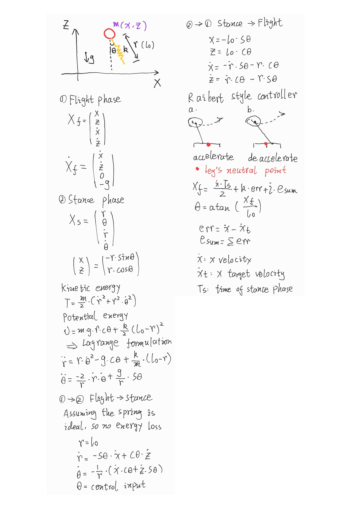

# 2D-SLIP-hopper-simulation
# About

Simulation of a 2D hopper using SLIP model and Raibert style controller.

# Dynamics

# Reference

[1]. M. Raibert, M. Chepponis and H. Brown, "Running on four  legs as though they were one," in IEEE Journal on Robotics  and Automation, vol. 2, no. 2, pp. 70-82, June 1986, doi:  10.1109/JRA.1986.1087044.

[2]. http://www.cim.mcgill.ca/~aki/research/SLIP_Hopper.htm

[3]. [Ch. 4 - Simple Models of Walking and Running (mit.edu)](http://underactuated.mit.edu/simple_legs.html#section3)
